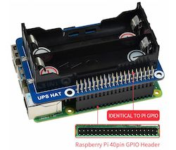
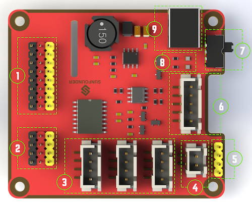
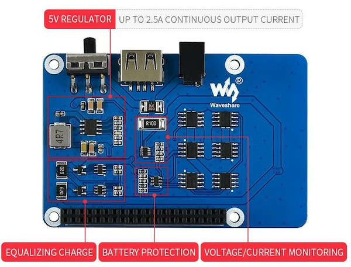
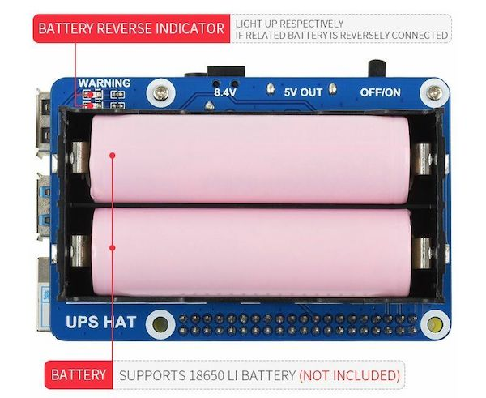
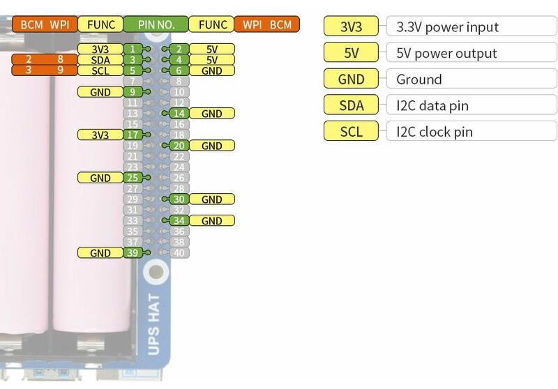

# Uninterruptible Power Supply

For Raspberry Pi [smart video car](https://www.sunfounder.com/collections/raspberry-pi-robot-for-intermediate/products/smart-video-car)
Here is some  [documentation](https://docs.sunfounder.com/projects/picar-v/en/latest/)

## Current situation

[Currently](https://docs.sunfounder.com/projects/picar-v/en/latest/components.html#robot-hats), the Raspberry is powerd with a [Robot hat](https://docs.sunfounder.com/projects/picar-v/en/latest/) (to [order](https://www.sunfounder.com/products/the-robot-hat-of-picar) it) but this comes with an disadvantage, that the power state of battery can't be monitored.

1. **Digital ports**: 3-wire digital sensor ports, signal voltage: 3.3V, VCC voltage: 3.3V.
2. **Analog ports**: 3-wire 4-channel 8-bit ADC sensor port, reference voltage: 3.3V, VCC voltage: 3.3V.
3. **I2C ports**: 3.3V I2C bus ports
4. **5V power output**: 5V power output to PWM driver.
5. **UART port**: 4-wire UART port, 5V VCC, perfectly working with SunFounder FTDI Serial to USB.
6. **Motor control** ports: 5V for motors, direction control of motors MA and MB and a floating pin NC ; working with SunFounder motor driver module.
7. **Switch**: power switch
8. **Power indicators**: indicating the voltage – 2 indicators on: >7.9V; 1 indicator on: 7.9V~7.4V; no indicator on: <7.4V. To protect the batteries, you’re recommended to take them out for charge when there is no indicator on. The power indicators depend on the voltage measured by the simple comparator circuit; the detected voltage may be lower than normal depending on loads, so it is just for reference.
9. **Power port**: 5.5/2.1mm standard DC port, input voltage: 8.4~7.4V (limited operating voltage: 12V~6V).

## Monitor battery state

The idea is to add an uninterruptible power supply [UPS hat](https://www.waveshare.com/wiki/UPS_HAT) (here where to [order](https://www.berrybase.de/ups-uninterruptible-power-supply-hat-fuer-raspberry-pi?sPartner=g_shopping&gclid=Cj0KCQjw2v-gBhC1ARIsAOQdKY29VPu9hsqQfoYeiSiyzLKwJkDEy4Q5z_65jnZvO0sZ0xYUOVUFfmYaAgfxEALw_wcB) it)

